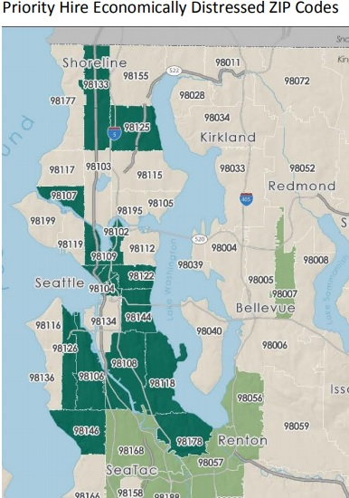
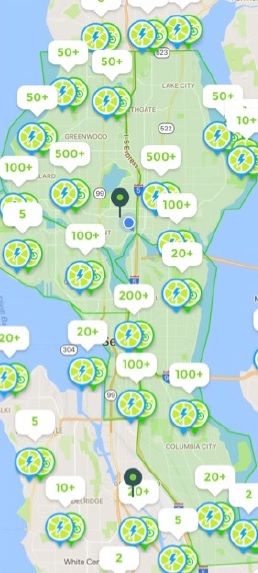
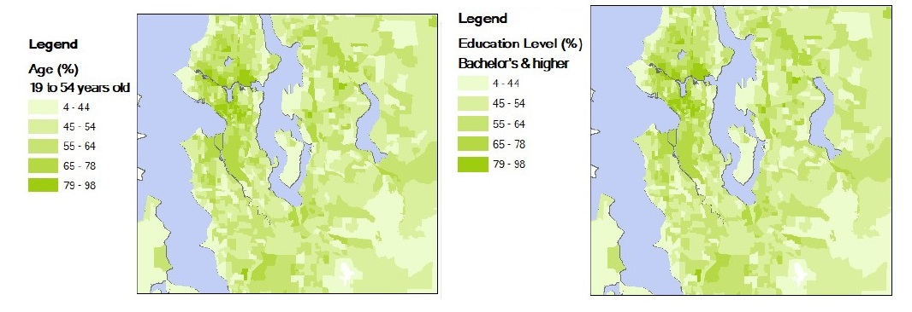

```{r setup, include=FALSE}
knitr::opts_chunk$set(echo = F, warning = F, message =  F)
library(tidyverse)
library(RefManageR)
library(kableExtra)

```

## Shared mobility service, dockless bikeshare

[Investors are putting money into bikeshare](http://kuow.org/post/how-do-seattles-bike-share-companies-make-money) companies such as Limebike, Ofo, and etc., which shows bikesharing business seems promising [@mcnicholsHowSeattleBike2018]. On the other hand, there is a skepticism about economic sustainability of the business at the same time. Nonetheless, there are increasing interests in shared mobility services such as Uber, Lyft, and bikesharing. 

Bikesharing has been in the city, Seattle. Pronto is one of the examples, a station-based bikesharing company that launched in 2014 with about $2.5 million private and \$1.7 million public financing. Unfortunately, making a loss, the [company](https://www.seattletimes.com/seattle-news/transportation/seattle-pronto-bike-share-shutting-down-friday/) shut down in early 2017 [@gutmanSeattleProntoBike2017], which shows quite different trend from New York where the station-based bike share accounted for half of all bike use in the US. Soon a boom of dockless bikeshare companies started exploring the city along with a government pilot program. Approximately 2,600 times riding on an average day, was reported for shared bikes in the city from mid-July to the end of the year, 2017 since the dockless bikeshare business started in Seattle. Riding the dockless bike are estimated to [0.84 times per day on average](https://www.seattletimes.com/seattle-news/transportation/seattle-still-using-bike-shares-but-were-not-big-fans-in-bad-weather-new-data-shows/) [@gutmanSeattleStillUsing2018a]. Currently there are almost 9,000 to 10,000 dockless bikes in Seattle. 

In national wide, [the National Association of City Transportation Officials (NACTO)](https://nacto.org/bike-share-statistics-2017/) reported that bikesharing had increased by 25 percent from 2016 to 2017 when people took 35 million trips in 2017 [@nactoBikeShare20172017]. While bikeshare has increased, the portion of dockless bike seems less, only composing of 4 percent of total trips as opposed to a station-based bike share (i.e. rest of 96%). Although Seattle is seeing dockless bikeshare business growing up, utilization of bike ride still fall behind. [New York has 2.9 times](https://www.seattletimes.com/seattle-news/transportation/seattle-still-using-bike-shares-but-were-not-big-fans-in-bad-weather-new-data-shows/) ride per day for each bike in December, which is about 13 times the amount of ride in Seattle the same period [@gutmanSeattleStillUsing2018a].

## Seattle's bike share permit

With the bike share pilot program in the city, there are permit requirements for startup companies need to follow for their businesses. For safety issues, there are certain rules for speed limits of 20 miles per hour and a electric motor capacity should be less than 750 watt with electric bikes. It requires companies to have a liability insurance in the same context. The requirements also extend to parking issues that there are restrictions on places to park bikes such that it is necessary to rebalance the number of bike by placing to other places as the city will remove bikes on its own in case bikes are parked in a disturbing manner or stay in the same place more than 7 consecutive days. This event will incur companies to pay back to the city for the cost occurring to move the bikes. The rule mandates companies to have enough staffs for the purpose of operation such as rebalancing the bikes. When it comes to a social equity, companies are required to have at least 20% of their bike service area in the [Tier 1 priority hire neighborhoods](http://www.seattle.gov/Documents/Departments/FAS/PurchasingAndContracting/Labor/Zip_Codes.pdf) as indicated in the map below [@seattlePRIORITYHIRECITY2016]. 

{width=250}


Most of all, an interesting part in the requirements is about data duty. Companies need to share the real time data to the city. This requirement could be exempted if companies have an agreement with [University of Washington (UW)](https://www.uwtdc.org/) for a purpose of research. But the data that the companies need to share with the UW research group seems more demanding such that requiring more information. 

Overall the city’s bike share permit requirements are quite reasonable with an intention for public safety, pursuing equity, research encouragement and financial risk averse for the city government to avoid any risk from the business loss of these startup companies. On the other hand, these requirements could be burdens to bikeshare businesses as they may hire more staffs to take care of individual bikes all around the city to make sure bikes are all parked well, rebalanced, and distributed evenly in addition to data related works such as equipping with digital communication systems, servers to store data, and sensors to collect data or monitor each bike.

## Cost-benefit analysis 

Station-based bikesharing companies are known to bear a capital cost of \$5,000 per bike and an operating cost of $2,000 per bike a year. Although, the capital cost of dockless bikes seem to be less as [\$300](http://kuow.org/post/how-do-seattles-bike-share-companies-make-money) per bike [@mcnicholsHowSeattleBike2018], there are other costs to consider with the city's pilot program that \$146 of annual permit, \$1,672 of street use, \$15/bike for administrations and performance bond of \$80/bike with a cap of \$10,000 annually. Cost-benefit analyses could be constructed to figure out the business sustainability of bikesharing in Seattle assuming the operating cost would be proportional to the capital cost the same as the station-based bikesharing, thus it is estimated \$120 per bike a year. There are 9,000 shared bikes in Seattle and utilization is 0.84 a day per bike in Seattle (Gutman 2018). It is \$ 1 per ride in general. Let’s assume only one company is running the bikeshare business in Seattle with the conditions described above for about 20 years and 6% annual discount rate. Costs for bikes and the user fee are assumed to increase 4% a year. 

```{r fig.cap= "Annual cash flow estimation (basic scenario)", fig.width= 5, fig.height= 4}

n = 9000 #number of bike
rt = 0.06 #discount rate

#cost
bc = 300 #capital cost per bike
bm = 120 #maintenance cost per bike
ac = 15*n #admin. cost
uc = 146+1672+10000+ac #upfront cost per year


#benefit
bn = 1 #fee 
ut = 0.84 #utilization

tc = uc+n*bc
q=data.frame(matrix(NA,20,4))
cf=-tc

for(i in 1:20){
    fv=(bn*ut*n*365 - (bm*n+uc))*1.04^i
    pv= fv/(1+rt)^i
    old=cf
    cf=cf+pv
    dp=ifelse(cf>0,i-1+abs(old/pv),0)
    q[i,]=c(fv,pv,cf,dp)
}

q=q/10^6
par(mfrow= c(1,1))
plot(q[,1], main = "Cash flow", ylab="m$", xlab="year",
     type = 'l', ylim = c(min(q[,3]),max(q[,3])), col = 'red',lwd=3,cex.main=0.9)
lines(q[,2], type = 'l', col='blue',lwd=3)
lines(q[,3], type = 'l', col='orange',lwd=3)
legend("topleft", legend=c("Annual FV","Annual PV","NPV"),col=c("red","blue","orange"), lty=1, box.lty = 0, lwd=7,cex=0.9)

```

The simulation shows that about in 3rd year, the business will reach the break-even point and will have about \$14 million net present value (NPV) for 20 years assuming the business maintains the same number of bike and there is no bike loss every year. The upfront cost including permit fees, capital costs, etc. is about \$2.84 million. Maintenance cost and profit occur every year with 0.84 utilization and \$1 rate per ride. The expected future value (FV) of annual profit is about \$1.53 million. This result is unexpectedly optimistic. Considering other uncertain factors such as other competitors in the same market, annual loss of bike, increasing needs of staffs, and weather condition affecting the utilization, the optimistic result would change. Let’s assume there are 2 more competitors sharing the market evenly, 10% of bikes are damaged and need to be replaced every year, maintenance cost becomes \$150 per bike a year to meet the additional works (real data collection, adding sensors, rebalancing, etc.), weather condition during November to March is not desirable for riding bikes so the utilization would be less than 0.84, lets’ say 0.4 during these 5 months. The NPV simulation in this updated condition, is as below.

```{r fig.cap= "Annual cash flow estimation (scenario with assumptions)", fig.width= 5, fig.height= 4}

n = 9000/3 #number of bike
rt = 0.06 #discount rate

#cost
bc = 300 #capital cost per bike
bm = 150 #maintenance cost per bike
ac = 15*n #admin. cost
uc = 146+1672+10000+ac #upfront cost per year


#benefit
bn = 1 #fee 
ut = (0.84*7 + 0.4*5)/12 #utilization

tc = uc+n*bc
q=data.frame(matrix(NA,20,4))
cf=-tc

for(i in 1:20){
    fv=(bn*ut*n*365 - (bm*n+uc) - 0.1*n*bc) * 1.04^i
    pv= fv/(1+rt)^i
    old=cf
    cf=cf+pv
    dp=ifelse(cf>0,i-1+abs(old/pv),0)
    q[i,]=c(fv,pv,cf,dp)
}

q=q/10^6
par(mfrow= c(1,1))
plot(q[,1], main = "Cash flow", ylab="m$", xlab="year",
     type = 'l', ylim = c(min(q[,3]),max(q[,3])), col = 'red',lwd=3,cex.main=0.9)
lines(q[,2], type = 'l', col='blue',lwd=3)
lines(q[,3], type = 'l', col='orange',lwd=3)
legend("bottomright", legend=c("Annual FV","Annual PV","NPV"),col=c("red","blue","orange"), lty=1, box.lty = 0, lwd=7,cex=0.9)

```


In this scenario, annual FV is \$1.2 million and NPV for 20 years is about \$0.44 million with discounted payback period (DPP) of 10.8 years. It would take at least more than 10 years to have the positive net profit. It shows that having more competitors in the same market, decreased utilization rate, and increased maintenance cost are the factors making the sustainability of business hard to achieve.

## Equity and efficiency 

One aspect of the requirements of the city’s permit is for equity such that bike share service should be at least 20% of the total service area in the Tier 1 priority hire neighborhoods. Considering the requirement, there seem to be high disparity in the bike service distribution in the city. One of the examples can be seen in a bike distribution map of one of the companies, Lime.

{width=150}

There are more bikes serving in area of north and city downtown compared to south. From the perspective of bikeshare companies, it is necessary to maximize profits. Figuring out the differences among these areas will help to understand dynamics of the disparity in the distribution of bikes. Age and education distributions in addition to population density in the city are quite corresponding with the distribution of Lime bikes. This phenomenon is understandable because seniors are less likely to ride bikes and UW has over 40,000 students such that students are more likely to ride bikes. The other supporting evidence why students are the reason to this distribution is normal class schedules which are widely spread out in time such that students may use bikes evenly all day long without noticeable peak demand. [National Association of City Transportation Officials](https://nacto.org/bike-share-statistics-2017/) also shows the different behavior of bike ride with the fact that 48% trips took place during rush hours and more than 70% of all trips happened on weekdays for station-based bike while Seattle presents evenly spread out bike use regardless of weekdays or weekends [@nactoBikeShare20172017]. Although they reasoned it due to the difference between dockless bikeshare and station-based bikeshare, it would be mostly from the difference of riders whether they are students or commuters (workers).   

{width=600}

So it could be concluded that current distribution of bikeshare service of Lime confirms the company is focusing on meeting demand of the service and profits. This is reasonable for the company to sustain its business. After a certain amount of time of initial stage, it can expand its business by focusing more on equity. The thing is it seems to be still hard to make profits even by pursuing efficiency (maximizing profit), given news reports that bikeshare startups are [still losing money](http://kuow.org/post/how-do-seattles-bike-share-companies-make-money) [@mcnicholsHowSeattleBike2018]. Considering it takes time to reach a break-even point (in the previous scenario, it takes at least 10 years) and the business just started a few month ago, it doesn’t make sense to expect profit now. Furthermore, there are usually several uncertainties in the initial period of startups. It takes time to be stable for the business to expect its profit on a given period.

Non-linear optimizations could be used to simulate the situation to figure out the impact of the equity oriented policy on bikesharing business. There is a fairness model which is going to be used for equity impact analysis of distribution of bikes. Let’s assume there are total 8 neighborhoods in Seattle (0.7 million people living in the city) and each neighborhood has different utilization rate (the number of ridden a bike a day). Assume the cost per bike (including maintenance and capital) is the same for all neighborhoods. Assume that annual average of the utilization rates are between 0.4 and 1.2 (0.4, 0.5, 0.6, 0.8, 0.9, 1, 1.1, and 1.2) and relative proportions of population density are 0.02, 0.1, 0.2, 0.08, 0.25, 0.15, 0.1, 0.03, and 0.07 in order of neighborhood index. The minimum population among these neighborhoods is 14 thousand people which is far more than the total number of 3,000 bikes available for the distribution. Let’s assume there is upper bounds such that the number of bike to be distributed to a neighborhood, can’t be more than 1% of the neighborhood population. If the number of bike put into the neighborhood is more than 1% of the neighborhood population, then the assumed utilization would change to be lower. Let’s assume the rest of conditions (i.e. the number of bike, competitors, weather condition, maintenance, capital costs and the loss of bike) are the same as the 2nd scenario in the cash flow analysis previously described. Given the same amount of upfront cost or investment capacity, the two different goals pursuing equity or efficiency oriented policy will show different results for a bike allocation.


```{r fig.cap= "Utilization and relative population of neighbors", fig.width= 7, fig.height= 3}

library(nloptr)
n = 9000/3 #number of bike
rt = 0.06 #discount rate
sp = 700000

#cost
bc = 300 #capital cost per bike
bm = 150 #maintenance cost per bike
ac = 15*n #admin. cost
uc = 146+1672+10000+ac #upfront cost per year
tc = uc+n*(bc+bm)

#benefit
bn = 1 #fee 
c = tc/n #cost for one bike
m = tc #capacity, total cost 
ut = c(0.4, 0.5, 0.6, 0.8, 0.9, 1, 1.1, 1.2) #utilization
b = ut*bn*365 #benefit for a bike
pop=c(0.02,0.1,0.2,0.08,0.25,0.15,0.08,0.12) #population weight
con_pop=pop*sp*0.01

par(mfrow=c(1,2))
names(ut) = c("cB_1","cB_2","cB_3","cB_4","cB_5","cB_6","cB_7","cB_8")
barplot(ut, col = "red", main = "Utilization of each neighbor", 
        xlab="neighbors", ylab="Utilization(# of ridden a day)",cex.names = 0.5)

names(pop) = c("cB_1","cB_2","cB_3","cB_4","cB_5","cB_6","cB_7","cB_8")
barplot(pop, col = "orange", main = "Relative population \n of neighbors", 
        xlab="neighbors", ylab="Relative portion of population",cex.names = 0.5)
```


```{r}

# Objective function EQUITY
alpha = 1 # fair
eval.f <- function(x) {return(-sum(b*log(x)))} #max

# Constraint function
# to be of the form g(x) <= 0
eval.g <- function(x) {
  return(sum(c*x) - m)
}

x0 <- rep(1,8)

opts <- list('algorithm' = 'NLOPT_GN_ISRES', 'xtol_rel' = 1.0e-8, 'maxeval' = 100000)

eq = nloptr(
  x0 = x0,
  eval_f = eval.f,
  lb = rep(0,8),
  ub = con_pop,
  eval_g_eq = eval.g,
  opts = opts
)


# Objective function Efficiency
alpha = 0 
eval.f <- function(x) {return (-sum(b*x^(1-alpha)/(1-alpha)))} #max


# Constraint function
# to be of the form g(x) <= 0
eval.g <- function(x) {
  return(sum(c*x) - m)
}

x0 <- rep(1,8)
opts <- list('algorithm' = 'NLOPT_GN_ISRES', 'xtol_rel' = 1.0e-8, 'maxeval' = 100000)

ef = nloptr(
  x0 = x0,
  eval_f = eval.f,
  lb = rep(0,8),
  ub = con_pop,
  eval_g_eq = eval.g,
  opts = opts
)

```

It is found that the equity oriented policy distributes bikes to all the neighborhoods while the efficiency oriented policy focuses only on half neighborhoods to maximize profits. In this simulation, the efficiency oriented policy will result in a profit of $\$`r round(-ef$objective/10^6,1)`$ in millions a year. On the other hand, the equity oriented policy will end up with $\$`r round(-eq$objective/10^3,1)`$ in thousands a year. This result is interesting because the total profit changes depending on how different portion of resources or bikes are put into individual neighborhoods. It also shows that it is possible to expedite the break-even point earlier by putting the different number of bikes to the individual neighborhoods.

```{r fig.cap= "Efficiency and equity policies", fig.width= 7, fig.height= 3}

par(mfrow=c(1,2))
bar1 = eq$solution
names(bar1) = c("cB_1","cB_2","cB_3","cB_4","cB_5","cB_6","cB_7","cB_8")
barplot(bar1, col = "blue", main = "Equity oriented policy", 
        xlab="Neighbors", ylim = c(0,1300),ylab="number of bikes",cex.names = 0.5)


bar = ef$solution
names(bar) = c("cB_1","cB_2","cB_3","cB_4","cB_5","cB_6","cB_7","cB_8")
barplot(bar, col = "red", main = "Efficiency oriented policy", 
        xlab="Neighbors", ylim = c(0,1300),ylab="number of bikes",cex.names = 0.5)

```

## Markov decision process for bike allocation

Let's imagine which policy would be preferred to distribute the limited bikes given a specific situation (e.g. how many bikes to be put in a certain neighborhood having a different utilization, population and etc.). Each year we can review the performance of bike distribution in neighborhoods and adjust them if needed for the following year. Efficiency oriented policy is definitely generating more money, but it would damage the business in a long run because pursuing efficiency or seeking maximum profits is not always a healthy strategy for a business. Sustaining a business requires keeping investments for future opportunities. In this regard equity oriented policy is also neccessary for the business to expand overall to other area rather than just focusing on a few neighborhoods. 

To figure out which policy would work better in a long run, Markov decision processes (MDP) was used for simulations. As described above, there is 700,000 people in Seattle and almost 9,000 dockless bikes with 3 competitors in this market. Let's assume there are 8 neighborhoods in Seattle and we need to distribute our bikes (only 3,000 considering a third market share) to these 8 neighborhoods. Each neighborhood has different utilization rates which keep changing every year, let's say there are only 4 states with the different utilization rates for each neighborhood. Each state features weighted concentration of utilization structures. State 1 and 4 are the ones with evenly distributed utilization while state 2 and 3 feature biased distribution of utilization rates. State 1 represents a situation where all neighborhoods have the same utilization rate that there is no difference. State 2 represents a biased uitilization distribution that those neighborhoods indexed later, have higher utilizations. State 3 is opposite that neighborhoods indexed earlier have higher ones while later indexed neighborhoods have zero utilization that means there is no demand for the shared bike. State 4 is the same as the state 1 that evenly distributed utilization but lower.   

```{r}
s1 = rep(0.8, 8)
s2 = c(rep(0.1, 5), 1.4, 2, 2.5)
s3 = c(4, 2, 0.4, 0,0,0,0,0)
s4 = rep(0.3, 8)
ss = rbind(s1,s2,s3,s4)
rownames(ss) = c("state 1","state 2","state 3", "state 4")
colnames(ss) = c("nb 1","nb 2","nb 3","nb 4","nb 5","nb 6","nb 7","nb 8")
prob = matrix(c(0.8,0.1,0.1,0,0,0,0,1), byrow = T, nrow=2, ncol=4)
pop=c(0.02,0.1,0.2,0.08,0.25,0.15,0.08,0.12) #population weight
con_pop=pop*sp*0.01

kable(ss, format = "latex", caption = "Each state of different utilization", booktabs = T) %>%
  kable_styling(latex_options = c("HOLD_position"))  %>%
  kable_styling(latex_options = "striped") 
```

There is a constraint of a upper bound that each neighborhood can't have bikes of more than 1% of it's population such that having bikes of more than 1% population would change the utilization rate. For the purpose of faster calculatoin all the computational values were scaled down to 1/100 that the population of Seattle, 700,000 became down to 7,000 and the number of bike for distribution, 3,000 became down to 30 bikes. The transition probability for one state to the other one is decided by policies. If our current state is on the equity oriented policy, then our next state would be 80% of state 1, and 10% of both state 2 and 3. This implies having equity oriented policy, overall, maintains the similar amount of utilization rates over the neighborhoods. On the other hand, if we are not on efficiency oriented policy, the next state would be most likely to the state 4 where all the utilization rates are lower but evenly distributed. This is because having the business in a few neighobrs and putting most of resources in a certain area endangers and poses an obstacle to sustain the business. 

```{r}

T=20 #number of stages
n = 90/3 #number of bike
rt = 0.06 #discount rate
sp = 7000
M=sp*0.01 #holding capacity

#cost
bc = 300 #capital cost per bike
bm = 150 #maintenance cost per bike
ac = 15*n #admin. cost
uc = 146+1672+10000+ac #upfront cost per year

#benefit
bn = 1 #fee 
tc = uc+n*(bc+bm)
c = tc/n #cost for one bike
m = tc #capacity, total cost 
ut = c(0.4, 0.5, 0.6, 0.8, 0.9, 1, 1.1, 1.2) #utilization

s1 = rep(0.8, 8)
s2 = c(rep(0.1, 5), 1.4, 2, 2.5)
s3 = c(4, 2, 0.4, 0,0,0,0,0)
s4 = rep(0.3, 8)
ss = rbind(s1,s2,s3,s4)

prob = matrix(c(0.8,0.1,0.1,0,0,0,0,1), byrow = T, nrow=2, ncol=4)

b = ut*bn*365 #benefit for a bike
pop=c(0.02,0.1,0.2,0.08,0.25,0.15,0.08,0.12) #population weight
con_pop=pop*sp*0.01

# Objective function EQUITY
EQ = function(b){
  alpha = 1 
  eval.f <- function(x) {return(-sum(b*log(x)))} #max
  eval.g <- function(x) {
    return(sum(c*x) - m)
  }
  x0 <- rep(1,8)
  opts <- list('algorithm' = 'NLOPT_GN_ISRES', 'xtol_rel' = 1.0e-8, 'maxeval' = 10000)
  eq = nloptr(
    x0 = x0,
    eval_f = eval.f,
    lb = rep(0,8),
    ub = con_pop,
    eval_g_eq = eval.g,
    opts = opts
  )
  return(list(so=eq$solution, val=eq$objective))
}

EF = function(b){
  # Objective function Efficiency
  alpha = 0 
  eval.f <- function(x) {return (-sum(b*x^(1-alpha)/(1-alpha)))} #max
  eval.g <- function(x) {
    return(sum(c*x) - m)
  }
  x0 <- rep(1,8)
  opts <- list('algorithm' = 'NLOPT_GN_ISRES', 'xtol_rel' = 1.0e-8, 'maxeval' = 10000)
  ef = nloptr(
    x0 = x0,
    eval_f = eval.f,
    lb = rep(0,8),
    ub = con_pop,
    eval_g_eq = eval.g,
    opts = opts
  )
  return(list(so=ef$solution, val=ef$objective))
}

Jstar=matrix(0,4,T+1) 
policy=matrix(0,4,T) 
min=array(0, dim = c(8,4,T))

for(t in T:1){
  for(s in 1:4){
    Q=c() 
    b = ss[s,]*365
    a = c(EQ(b), EF(b))
    for(i in 1:2){
      Q[i]= - a[[i*2]] + prob[i,] %*% Jstar[,t+1]
    }
    Jstar[s,t]=max(Q)
    policy[s,t]=which.max(Q)
    min[,s,t] = a[[which.max(Q)*2-1]]
  }
}

```

Nonetheless, the results show that mostly effieciency oriented policy is dominant over equity oriented policy. It is because the expected pay off on the efficiency oriented policy is far more. It may be neccessary to mandate the company to execute the equity oriented policy in cooperation with the city government like the case of the pilot program where it recommended for bikeshare companies to have services at least 20% of the Tier 1 priority hire neighborhoods. 

```{r}

plot(Jstar[1,-21]/1000, main = "Expected values in each state", ylab="$ in thousands", xlab="year",
     type = 'l', ylim=c(4, 135), col = 'red',lwd=3,cex.main=0.9)
lines(Jstar[2,-21]/1000, type = 'l', col='blue',lwd=3)
lines(Jstar[3,-21]/1000, type = 'l', col='orange',lwd=3)
lines(Jstar[4,-21]/1000, type = 'l', col='purple',lwd=3)
legend("right", legend=c("state 1","state 2","state 3", "state 4"),col=c("red","blue","orange","purple"), lty=1, box.lty = 0, lwd=7,cex=0.9)


```


```{r}

sta = t(Jstar)
sta = sta[-21,]
sta = cbind(c(1:20), sta)
colnames(sta)= c("Year","state 1","state 2","state 3", "state 4")
sta=data.frame(sta)

kable(sta, format = "latex", caption = "Expected values in each state", booktabs = T) %>%
  kable_styling(latex_options = c("hold_position"))  %>%
  kable_styling(latex_options = "striped") %>%
  kable_styling(font_size = 9)

```


```{r}

pol = t(policy)
pol = pol[-21,]
pol = cbind(c(1:20), pol)
colnames(pol)= c("Year","state 1","state 2","state 3","state 4")
pol=data.frame(pol)

kable(pol, format = "latex", caption = "Policy recommendation for each state [note]", booktabs = T) %>%
  kable_styling(latex_options = c("HOLD_position"))  %>%
  kable_styling(latex_options = "striped") %>%
  add_footnote(c("1 for equity; 2 for efficiency policy"), notation = "symbol") %>%
  kable_styling(font_size = 9)

```

Interestingly, most of state 4 indicates equity oriented policy is optimal than the counterpart policy. It is because choosing the policy focusing on equity will improve the overall utilization rates on following states. It is quite intuitive that if a busness is in a bad way, that is the time to invest for improving capacities and overall business conditions rather than seeking profits. We can see state 2 and 3 are more biased as expected with the probability distributions. Comparatively state 1 and 4 shows somehow stable distributions. All of the results could be interpreted with 100 mutiltiplications as the data was scaled down (e.g. if number of bike is 10, then interprete it as 1,000) for the etimation in the real world. 


```{r fig.cap = "Neighborhood bike distribution with optimal policies (state 1 and 2)", fig.width= 7, fig.height= 3}

par(mfrow=c(1,2))
boxplot(t(min[,1,]), main = "State 1 in 20 years",xlab = "Neighborhood", ylab = "number of bikes")
boxplot(t(min[,2,]),main = "State 2 in 20 years", xlab = "Neighborhood", ylab = "number of bikes")
```


```{r fig.cap = "Neighborhood bike distribution with optimal policies (state 3 and 4)", fig.width= 7, fig.height= 3}

par(mfrow=c(1,2))
boxplot(t(min[,3,]), main = "State 3 in 20 years",xlab = "Neighborhood", ylab = "number of bikes")
boxplot(t(min[,4,]),main = "State 4 in 20 years", xlab = "Neighborhood", ylab = "number of bikes")
```


The city needs to help the bikeshare startups to settle in their businesses at the initial period. We saw the case of the fall of the previous company, Pronto. In this regard dockless startups should concentrate on the efficiency oriented policy by putting their resources or bikes into neighborhoods where higher utilization or demand are expected for sure. After reaching the break-even point, they would be better off by focusing more on the equity oriented policy in cooperation with the city government so that they can sustain their business forward. By doing so, the business can benefit citizens in Seattle in a long run. 


## Reference 


