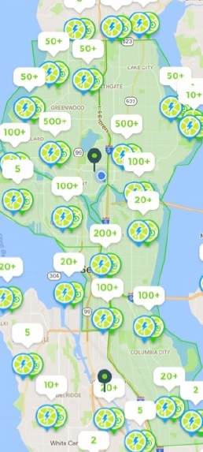

Shared mobility service, dockless bikeshare
-------------------------------------------

[Investors are putting money into
bikeshare](http://kuow.org/post/how-do-seattles-bike-share-companies-make-money)
companies such as Limebike, Ofo, and etc., which shows bikesharing
business seems promising (McNichols 2018). On the other hand, there is a
skepticism about economic sustainability of the business at the same
time. Nonetheless, there are increasing interests in shared mobility
services such as Uber, Lyft, and bikesharing.

Bikesharing has been in the city, Seattle. Pronto is one of the
examples, a station-based bikesharing company that launched in 2014 with
about $2.5 million private and $1.7 million public financing.
Unfortunately, making a loss, the
[company](https://www.seattletimes.com/seattle-news/transportation/seattle-pronto-bike-share-shutting-down-friday/)
shut down in early 2017 (Gutman 2017), which shows quite different trend
from New York where the station-based bike share accounted for half of
all bike share in the US. Soon a boom of dockless bikeshare companies
started exploring the city along with a government pilot program.
Approximately 2,600 times riding on an average day, was reported for
shared bikes in the city from mid-July to the end of the year, 2017
since the dockless bikeshare business started in Seattle. Riding the
dockless bike are estimated to [0.84 times per day on
average](https://www.seattletimes.com/seattle-news/transportation/seattle-still-using-bike-shares-but-were-not-big-fans-in-bad-weather-new-data-shows/)
(Gutman 2018). Currently there are almost 9,000 to 10,000 dockless bikes
in Seattle.

In national wide, [the National Association of City Transportation
Officials (NACTO)](https://nacto.org/bike-share-statistics-2017/)
reported that bikesharing had increased by 25 percent from 2016 to 2017
when people took 35 million trips in 2017 (NACTO 2017). While bikeshare
has increased, the portion of dockless bike seems less, only composing
of 4 percent of total trips as opposed to a station-based bike share
(i.e. rest of 96%). Although Seattle is seeing dockless bikeshare
business growing up, utilization of bike ride still fall behind. [New
York has 2.9
times](https://www.seattletimes.com/seattle-news/transportation/seattle-still-using-bike-shares-but-were-not-big-fans-in-bad-weather-new-data-shows/)
ride per day for each bike in December, which is about 13 times the
amount of ride in Seattle the same period (Gutman 2018).

Seattle's bike share permit
---------------------------

With the bike share pilot program in the city, there are permit
requirements for startup companies need to follow for their businesses.
For safety issues, there are certain rules for speed limits of 20 miles
per hour and a electric motor capacity should be less than 750 watt with
electric bikes. It requires companies to have a liability insurance in
the same context. The requirements also extend to parking issues that
there are restrictions on places to park bikes such that it is necessary
to rebalance the number of bike by placing to other places as the city
will remove bikes on its own in case bikes are parked in a disturbing
manner or stay in the same place more than 7 consecutive days. This
event will incur companies to pay back to the city for the cost
occurring to move the bikes. The rule mandates companies to have enough
staffs for the purpose of operation such as rebalancing the bikes. When
it comes to a social equity, companies are required to have at least 20%
of their bike service area in the [Tier 1 priority hire
neighborhoods](http://www.seattle.gov/Documents/Departments/FAS/PurchasingAndContracting/Labor/Zip_Codes.pdf)
as indicated in the map below (Seattle 2016).

Most of all, an interesting part in the requirements is about data duty.
Companies need to share the real time data to the city. This requirement
could be exempted if companies have an agreement with [University of
Washington (UW)](https://www.uwtdc.org/) for a purpose of research. But
the data that the companies need to share with the UW research group
seems more demanding such that requiring more information.

NA

Cost-benefit analysis
---------------------

NA

NA

In this scenario, annual FV is $1.2 million and NPV for 20 years is
about $0.44 million with discounted payback period (DPP) of 10.8 years.
It would take at least more than 10 years to have the positive net
profit. It shows that having more competitors in the same market,
decreased utilization rate, and increased maintenance cost are the
factors making the sustainability of business hard to achieve.

Equity and efficiency
---------------------

NA

There are more bikes serving in area of north and city downtown compared
to south. From the perspective of bikeshare companies, it is necessary
to maximize profits. Figuring out the differences among these areas will
help to understand dynamics of the disparity in the distribution of
bikes. Age and education distributions in addition to population density
in the city are quite corresponding with the distribution of Lime bikes.
This phenomenon is understandable because seniors are less likely to
ride bikes and UW has over 40,000 students such that students are more
likely to ride bikes. The other supporting evidence why students are the
reason to this distribution is normal class schedules which are widely
spread out in time such that students may use bikes evenly all day long
without noticeable peak demand. [National Association of City
Transportation Officials](https://nacto.org/bike-share-statistics-2017/)
also shows the different behavior of bike ride with the fact that 48%
trips took place during rush hours and more than 70% of all trips
happened on weekdays for station-based bike while Seattle presents
evenly spread out bike use regardless of weekdays or weekends (NACTO
2017). Although they reasoned it due to the difference between dockless
bikeshare and station-based bikeshare, it would be mostly from the
difference of riders whether they are students or commuters (workers).

NA

NA

It is found that the equity oriented policy distributes bikes to all the
neighborhoods while the efficiency oriented policy focuses only on half
neighborhoods to maximize profits. In this simulation, the efficiency
oriented policy will result in a profit of $1.4 in millions a year. On
the other hand, the equity oriented policy will end up with $14.7 in
thousands a year. This result is interesting because the total profit
changes depending on how different portion of resources or bikes are put
into individual neighborhoods. It also shows that it is possible to
expedite the break-even point earlier by putting the different number of
bikes to the individual neighborhoods.

Markov decision process for bike allocation
-------------------------------------------

Let's imagine which policy would be preferred to distribute the limited
bikes given a specific situation (e.g. how many bikes to be put in a
certain neighborhood having a different utilization, population and
etc.). Each year we can review the performance of bike distribution in
neighborhoods and adjust them if needed for the following year.
Efficiency oriented policy is definitely generating more money, but it
would damage the business in a long run because pursuing efficiency or
seeking maximum profits is not always a healthy strategy for a business.
Sustaining a business requires keeping investments for future
opportunities. In this regard equity oriented policy is also necessary
for the business to expand overall to other area rather than just
focusing on a few neighborhoods.

To figure out which policy would work better in a long run, Markov
decision processes (MDP) was used for simulations. As described above,
there is 700,000 people in Seattle and almost 9,000 dockless bikes with
3 competitors in this market. Let's assume there are 8 neighborhoods in
Seattle and we need to distribute our bikes (only 3,000 considering a
third market share) to these 8 neighborhoods. Each neighborhood has
different utilization rates which keep changing every year, let's say
there are only 4 states with the different utilization rates for each
neighborhood. Each state features weighted concentration of utilization
structures. State 1 and 4 are the ones with evenly distributed
utilization while state 2 and 3 feature biased distribution of
utilization rates. State 1 represents a situation where all
neighborhoods have the same utilization rate that there is no
difference. State 2 represents a biased utilization distribution that
those neighborhoods indexed later, have higher utilization. State 3 is
opposite that neighborhoods indexed earlier have higher ones while later
indexed neighborhoods have zero utilization that means there is no
demand for the shared bike. State 4 is the same as the state 1 that
evenly distributed utilization but lower.

There is a constraint of a upper bound that each neighborhood can't have
bikes of more than 1% of it's population such that having bikes of more
than 1% population would change the utilization rate. For the purpose of
faster calculation all the computational values were scaled down to
1/100 that the population of Seattle, 700,000 became down to 7,000 and
the number of bike for distribution, 3,000 became down to 30 bikes. The
transition probability for one state to the other one is decided by
policies. If our current state is on the equity oriented policy, then
our next state would be 80% of state 1, and 10% of both state 2 and 3.
This implies having equity oriented policy, overall, maintains the
similar amount of utilization rates over the neighborhoods. On the other
hand, if we are not on efficiency oriented policy, the next state would
be most likely to the state 4 where all the utilization rates are lower
but evenly distributed. This is because having the business in a few
neighbors and putting most of resources in a certain area endangers and
poses an obstacle to sustain the business.

Nonetheless, the results show that mostly efficiency oriented policy is
dominant over equity oriented policy. It is because the expected pay off
on the efficiency oriented policy is far more. It may be necessary to
mandate the company to execute the equity oriented policy in cooperation
with the city government like the case of the pilot program where it
recommended for bikeshare companies to have services at least 20% of the
Tier 1 priority hire neighborhoods.

Interestingly, most of state 4 indicates equity oriented policy is
optimal than the counterpart policy. It is because choosing the policy
focusing on equity will improve the overall utilization rates on
following states. It is quite intuitive that if a business is in a bad
way, that is the time to invest for improving capacities and overall
business conditions rather than seeking profits. We can see state 2 and
3 are more biased as expected with the probability distributions.
Comparatively state 1 and 4 shows somehow stable distributions. All of
the results could be interpreted with 100 multiplication as the data was
scaled down (e.g. if number of bike is 10, then interpret it as 1,000)
for the estimation in the real world.

The city needs to help the bikeshare startups to settle in their
businesses at the initial period. We saw the case of the fall of the
previous company, Pronto. In this regard dockless startups should
concentrate on the efficiency oriented policy by putting their resources
or bikes into neighborhoods where higher utilization or demand are
expected for sure. After reaching the break-even point, they would be
better off by focusing more on the equity oriented policy in cooperation
with the city government so that they can sustain their business
forward. By doing so, the business can benefit citizens in Seattle in a
long run.

Reference
---------

Gutman, David. 2017. “Seattle’s Pronto Bike Share Shut down on March 31
| the Seattle Times.”
https://www.seattletimes.com/seattle-news/transportation/seattle-pronto-bike-share-shutting-down-friday/.

———. 2018. “Seattle Still Using Bike Shares, but We’re Not Big Fans in
Bad Weather, New Data Shows | the Seattle Times.”
https://www.seattletimes.com/seattle-news/transportation/seattle-still-using-bike-shares-but-were-not-big-fans-in-bad-weather-new-data-shows/.

McNichols, Joshua. 2018. “How Do Seattle’s Bike Share Companies Make
Money?”
http://kuow.org/post/how-do-seattles-bike-share-companies-make-money.

NACTO. 2017. “Bike Share in the U.S.: 2017.” *National Association of
City Transportation Officials*.
https://nacto.org/bike-share-statistics-2017/.

Seattle, Government. 2016. “PRIORITY HIRE in the CITY of SEATTLE and
KING COUNTY.”
http://www.seattle.gov/Documents/Departments/FAS/PurchasingAndContracting/Labor/Zip\_Codes.pdf.
